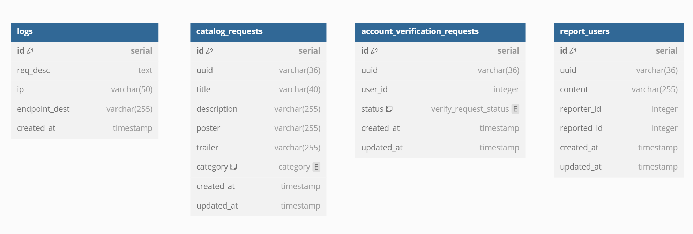

# DQ SOAP Service

DQ SOAP Service merupakan service yang bertugas untuk menjalankan *business logic* dari DQ App. Adapun fungsionalitas yang menjadi tanggung jawab dari service ini, antara lain *account verification*, *report user*, dan *catalog request*.

## Daftar Isi
- [Tech Stack](#tech-stack)
- [Cara Menjalankan](#cara-menjalankan)
- [Skema Basis Data](#skema-basis-data)
- [Endpoint API](#endpoint-api)
- [Pembagian Tugas](#pembagian-tugas)

## Tech Stack
### Bahasa Pemrograman
- Java
### Tools
- JAXWS
- JDBC
- Maven
- Lombok

## Cara Menjalankan

Terdapat dua opsi untuk menjalankan service ini, yaitu

### Tanpa Docker
1. *Clone* repositori ini
2. Masuk ke *root* folder repositori
3. Pastikan Java v8 sudah ter*install* 
4. Run `main` method pada `src/main/java/org/soapService/App.java` dengan menggunakan metode yang diinginkan. (Ex, menggunakan maven atau *runner* Intellij IDEA)
5. Service dapat diakses melalui *endpoint* yang telah ditentukan (*default*: http://localhost:8083)
### Dengan Docker
1. Jalankan docker-compose pada repositori [config]().
2. Service dapat menerima *request* melalui *endpoint* yang telah ditentukan (*default*: http://localhost:3002)

> ⚠️ Service ini menggunakan *database* yang dijalankan pada docker. Jika ingin menggunakan pendekatan yang sama, jalankan docker-compose pada repositori [config](). Anda juga dapat menggunakan *database* lain, masukkan kredensial database pada file `.env`.

## Skema Basis Data
Berikut merupakan skema basis data service ini,

## Endpoint API
|Endpoint|Operation|Keterangan
|--|--|--|
|/account-verification-request|GetRequests|Get Account Verification Request|
|/account-verification-request|CreateRequest|Create Account Verification Request|
|/account-verification-request|AcceptRequest|Accept Account Verification Request|
|/account-verification-request|RejectRequest|Reject Account Verification Request|
|/account-verification-request|DeleteRequest|Delete Account Verification Request|
|/report-user|CreateReport|Create Report User|
|/report-user|GetReportedUsers|Get Reported Users|
|/report-user|BlockUser|Block User|
|/report-user|DeleteReport|Delete Report User|
|/catalog-request|CatalogCreateRequest|Create Catalog Request|
|/catalog-request|GetRequests|Get Catalog Requests|
|/catalog-request|GetRequest|Get Catalog Request|
|/catalog-request|AcceptRequest|Accept Catalog Request|
|/catalog-request|RejectRequest|Reject Catalog Request|
|/catalog-reqeust|DeleteRequest|Delete Catalog Request|

## Pembagian Tugas
|Fungsionalitas|Contributor|
|--|--|
|Get Account Verification Request|13521153|
|Create Account Verification Request|13521153|
|Accept Account Verification Request|13521153|
|Reject Account Verification Request|13521153|
|Delete Account Verification Request|13521153|
|Create Report User|13521150|
|Get Reported Users|13521150|
|Block User|13521150|
|Delete Report User|13521150|
|Create Catalog Request|13521048, 13521153|
|Get Catalog Requests|13521048, 13521153|
|Get Catalog Request|13521048, 13521153|
|Accept Catalog Request|13521048, 13521153|
|Reject Catalog Request|13521048, 13521153|
|Delete Catalog Request|13521048, 13521153|
|Email Verification Accepted|13521150|
